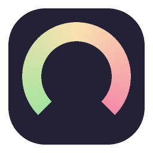

<p align="center">
  
</p>

# OpenCode Tray

Aplikacja dla Windows, która mieszka w zasobniku systemowym (tray) i pokazuje
bieżące wykorzystanie limitów subskrypcji **OpenCode Go** — okna 5-godzinnego,
tygodniowego i miesięcznego — wraz z informacją, kiedy każdy z limitów zostanie
zresetowany.

Po najechaniu kursorem na ikonę w zasobniku pojawia się czytelny panel ze
szczegółami (procent wykorzystania, pasek postępu i czas do resetu).

## Funkcje

- Ikona w zasobniku systemowym z podsumowaniem limitów 5h / tydzień / miesiąc.
- Panel szczegółów wyświetlany po najechaniu na ikonę:
  - procent wykorzystania każdego okna,
  - pasek postępu,
  - dokładny czas resetu (data + czas względny, np. „za 2 godz. 15 min”).
- Zmiana kolorów: zielony → żółty → czerwony wraz ze zbliżaniem się do limitu;
  ikona zmienia się na alertową, gdy któryś limit zostanie osiągnięty.
- Powiadomienie systemowe po osiągnięciu limitu (opcjonalne).
- Menu kontekstowe: odświeżanie, ustawienia, link do konsoli OpenCode, autostart, wyjście.
- Uruchamianie automatycznie przy starcie systemu Windows (można przełączać).
- Ustawienia: klucz API OpenCode Go oraz częstotliwość odświeżania w minutach.
- Instalator (NSIS), instalacja per-user — **bez uprawnień administratora**.
- Działa na Windows 10 i nowszych (x64).

## Instalacja

1. Pobierz `OpenCodeTray-Setup-<wersja>.exe` z sekcji
   [Releases](https://github.com/michalkulik/opencode-tray/releases).
2. Uruchom instalator. Aplikacja instaluje się w
   `%LOCALAPPDATA%\Programs\OpenCode Tray` i domyślnie dodaje się do autostartu.
3. Kliknij ikonę w zasobniku prawym przyciskiem → **Ustawienia…** i wklej swój
   klucz API OpenCode Go (do pobrania na <https://opencode.ai/auth>).
4. Ustaw częstotliwość odświeżania (domyślnie 5 minut) i zapisz.

Aby zobaczyć panel limitów — najedź kursorem na ikonę w zasobniku.

## Skąd pochodzą dane

Aplikacja odpytuje publiczny endpoint API OpenCode Go:

```
GET https://opencode.ai/zen/go/v1/usage
Authorization: Bearer <klucz API>
```

Odpowiedź zawiera trzy okna limitów (`rolling` = 5 godzin, `weekly`, `monthly`),
a dla każdego z nich `status`, `percent` oraz `resetsAt`.

## Ustawienia

Ustawienia i klucz API są zapisywane w:

```
%APPDATA%\OpenCodeTray\settings.json
```

> **Uwaga:** klucz API jest przechowywany w tym pliku jawnym tekstem. Plik leży
> w profilu użytkownika i nie jest współdzielony między kontami.

## Budowanie ze źródeł

Wymagania:

- [.NET 8 SDK](https://dotnet.microsoft.com/download)
- [NSIS](https://nsis.sourceforge.io/) (do zbudowania instalatora)

Na Windows:

```powershell
dotnet publish src/OpenCodeTray/OpenCodeTray.csproj -c Release -o src/OpenCodeTray/bin/publish
makensis installer/installer.nsi
```

Wynik: `dist\OpenCodeTray-Setup-1.0.0.exe`.

Na Linuksie można zbudować dokładnie to samo (bez uruchamiania aplikacji),
ponieważ projekt ma włączone `EnableWindowsTargeting`, a `makensis` potrafi
cross-kompilować instalator:

```bash
./build.sh
```

### Automatyczne buildy (GitHub Actions)

Workflow [`.github/workflows/build.yml`](.github/workflows/build.yml) buduje
aplikację i instalator na `windows-latest`. Każdy push do gałęzi `main`
tworzy artefakt `OpenCodeTray-Setup`, a wypchnięcie taga `vX.Y.Z` dodatkowo
publikuje instalator jako GitHub Release:

```bash
git tag v1.0.0
git push origin v1.0.0
```

## Struktura projektu

```
src/OpenCodeTray/          # aplikacja WinForms (tray)
  UsageClient.cs           # klient endpointu /zen/go/v1/usage
  TrayApplicationContext.cs# ikona, menu, timer, powiadomienia
  HoverPopupForm.cs        # panel pokazywany po najechaniu
  SettingsForm.cs          # okno ustawień
  AppSettings.cs           # model i zapis ustawień
  StartupManager.cs        # autostart przez rejestr HKCU Run
  Assets/                  # ikony .ico
installer/installer.nsi    # skrypt instalatora NSIS
build.sh                   # build (Linux/WSL lub Git Bash)
```

## Licencja

MIT — zobacz [LICENSE](LICENSE).
